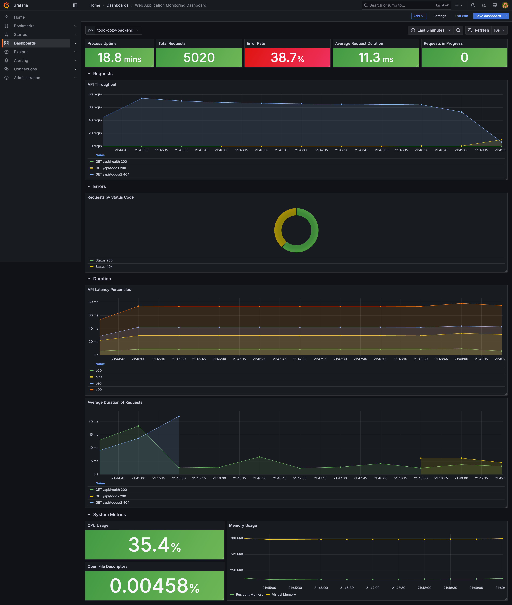
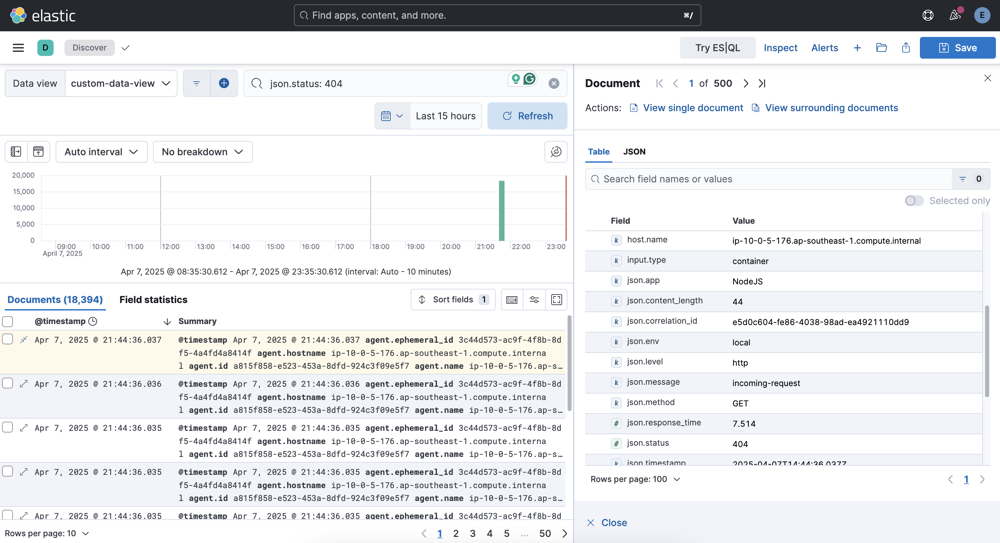
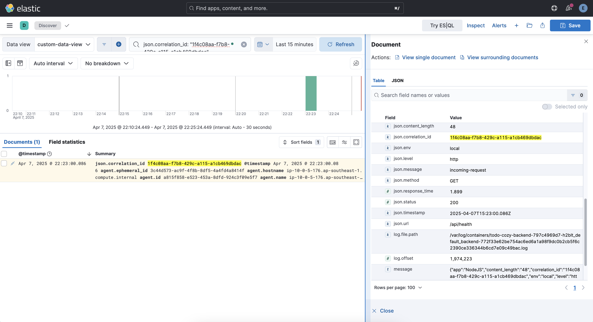
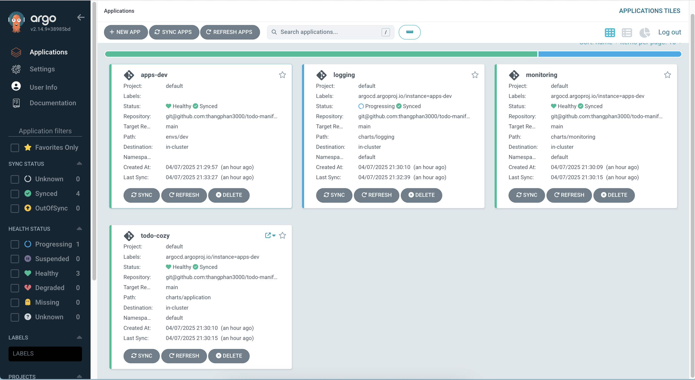

# Cozy Todo - End-to-End DevOps Automation with AWS & Kubernetes documentation

## Table of contents

- Grafana Monitoring Dashboard

## 📊 Grafana Monitoring Dashboard

This dashboard is used for real-time monitoring of a web application's backend (e.g., `todo-cozy-backend`) performance and system metrics. It provides visibility into request patterns, error rates, and server resource utilization.

### Overall dashboard

### 🔹 Key Metrics Overview

- **Process Uptime**: Shows how long the service has been running (e.g., 18.8 minutes).
- **Total Requests**: Cumulative HTTP requests received (e.g., 5020).
- **Error Rate**: Percentage of failed requests (e.g., 38.7%), highlighting reliability issues.
- **Average Request Duration**: Tracks average request handling time (e.g., 11.3 ms).
- **Requests in Progress**: Indicates how many requests are currently being processed.

### 🔹 Requests - API Throughput

- Line chart showing HTTP request throughput per endpoint (`/api/todos`, `/api/todo/2`, etc.).
- Helps identify traffic trends and peak times.

### 🔹 Errors - Requests by Status Code

- Donut chart visualizing the distribution of HTTP response codes (e.g., 200 OK vs. 404 Not Found).
- Useful for quickly spotting anomalies in request handling.

### 🔹 Duration - API Latency Percentiles

- Graph showing p50, p75, p90, p95, and p99 latency percentiles.
- Helps analyze the distribution of response times and detect slow-performing endpoints.

### 🔹 Average Duration of Requests

- Endpoint-specific request duration over time.
- Supports performance tuning and identifying bottlenecks.

### 🔹 System Metrics

- **CPU Usage**: Current CPU usage percentage (e.g., 35.4%).
- **Memory Usage**: Memory consumption trends (Resident & Virtual memory).
- **Open File Descriptors**: Tracks file descriptor usage to monitor system resource limits.

## 📘 Kibana Logging & Monitoring – Documentation

### 🔍 Log Aggregation & Querying with Kibana

To monitor and troubleshoot backend applications, I integrated **Kibana** as part of the ELK (Elasticsearch, Logstash, Kibana) stack. Logs from the Kubernetes pods deployed on **AWS EKS** were collected and shipped to **Elasticsearch**, enabling powerful querying and visualization in Kibana.

### ✅ Key Use Cases

- **Real-Time Log Streaming**  
  Monitored live logs during deployments and incident response using Kibana’s live log stream feature.

- **Custom Log Queries**  
  Queried application logs using filters such as:

  - `status:500` to detect server errors
  - `correlation_id: backend` to get application log and http log
  - `message: message` to error message

### 🖼️ Screenshot Example

> **Figure 1**: Kibana query filtering backend service logs(application log) for `json.status: 404` errors
>
> 

> **Figure 2**: Kibana query filtering backend service logs(http log) for `json.correlation_id: "1f4c08aa-f7b8-429c-a115-a1cb469dbdac"` error
>
> 

## 🚀 Argo CD – App of Apps Pattern Deployment

### 🧩 Overview

This project uses **Argo CD** with the **App of Apps** pattern to manage and deploy a monolith application stack on **Kubernetes (AWS EKS)**. The parent application (`apps-dev`) acts as a single entry point to deploy and manage multiple child applications defined in Helm charts.

### 📦 Parent App: `apps-dev`

- **Project**: `default`
- **Path**: `envs/dev`
- **Repository**: GitOps-style repo (`git@github.com:thangphan3000/todo-manifests`)
- **Function**: Defines the list of child applications to be deployed and managed.
- **Deployment Target**: In-cluster

---

### 🌱 Child Applications Managed by `apps-dev`

1. **todo-cozy**

   - Path: `charts/application`
   - Deploys the backend/frontend app (likely a fullstack app).
   - Status: ✅ _Healthy_ / _Synced_

2. **logging**

   - Path: `charts/logging`
   - Deploys the centralized logging stack (e.g., Fluent Bit, Elasticsearch, Kibana).
   - Status: 🔄 _Progressing_

3. **monitoring**
   - Path: `charts/monitoring`
   - Deploys monitoring tools (e.g., Prometheus, Grafana).
   - Status: ✅ _Healthy_ / _Synced_

---

### ✅ Benefits of App of Apps Pattern

- Centralized management of all environment-specific applications.
- Easy to extend or scale by simply adding new apps to the parent manifest.
- Fully GitOps-compatible: all changes are version-controlled and auditable.

---

### 🖼️ Screenshot Reference

> **Figure**: Argo CD UI showing synced applications from the App of Apps pattern deployment
>
> 
