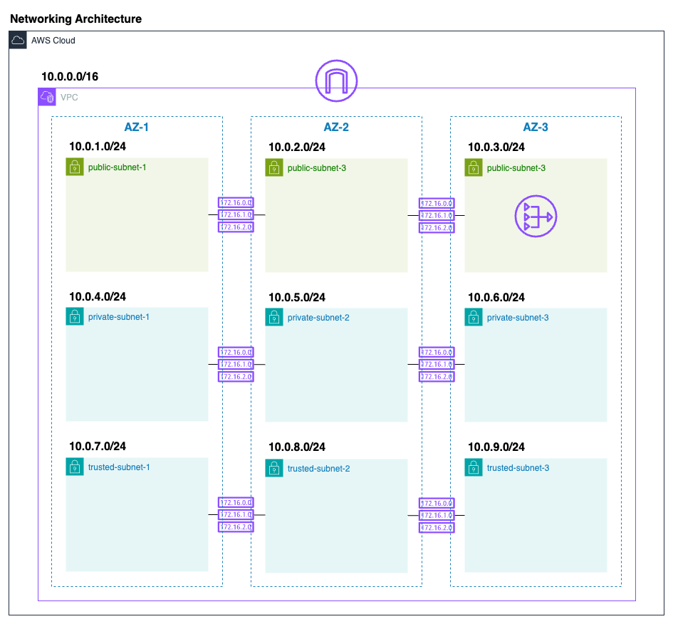
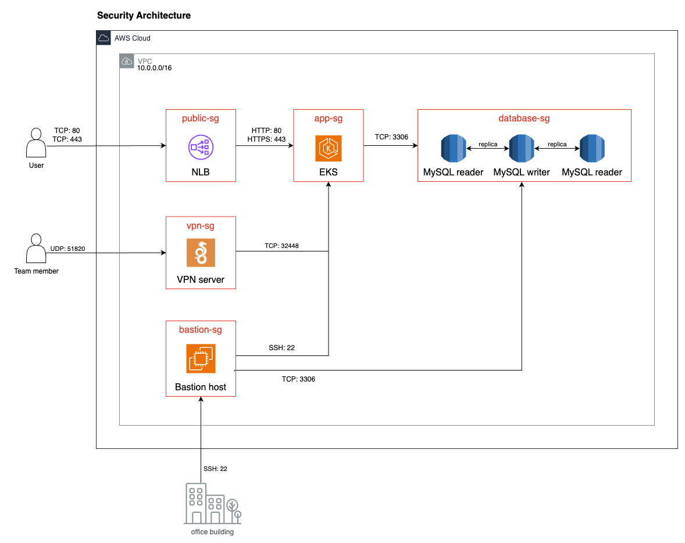
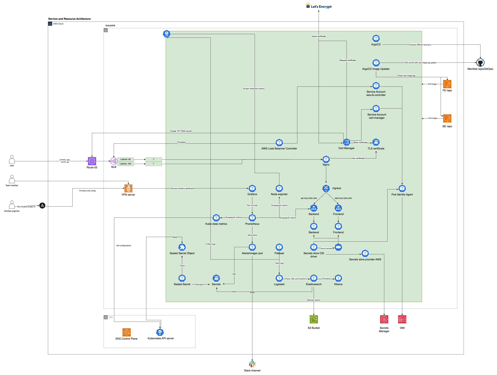
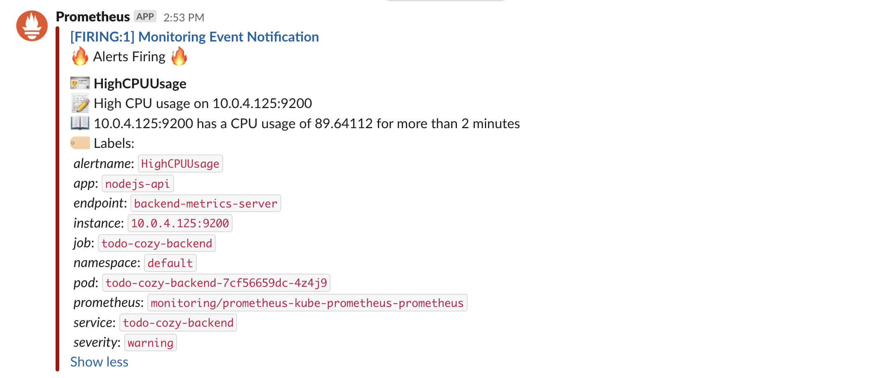
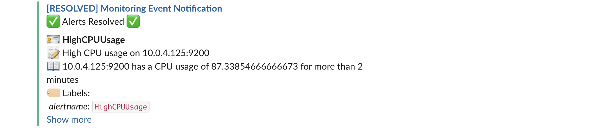
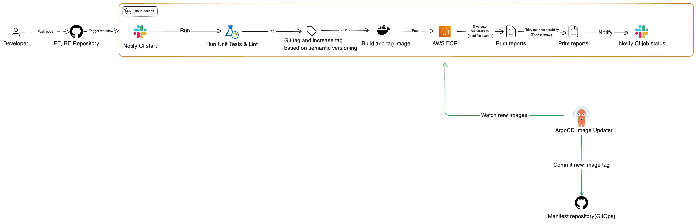

# Cozy Todo - End-to-End DevOps Automation with AWS & Kubernetes

A production-grade Todo application showcasing complete DevOps automation — including CI/CD pipelines, monitoring, logging, and GitOps-based deployments using AWS EKS and Kubernetes.

## Table of Contents

- [Project Links](#project-links)
- [Technologies Used](#technologies-used)
- [AWS Networking, Security, Resource and Service Architecture](#aws-networking-security-resource-and-service-architecture)
  - [Networking Architecture](#networking-architecture)
  - [Security Architecture](#security-architecture)
  - [Resource and Service Architecture](#resource-and-service-architecture)
- [Grafana Monitoring Dashboard](#grafana-monitoring-dashboard)
- [Kibana Logging with ELK Stack](#kibana-logging-with-elk-stack)
- [Argo CD – App of Apps Pattern Deployment](#argo-cd--app-of-apps-pattern-deployment)
- [Alert Manager & Slack](#alert-manager--slack)
- [GitHub Actions Workflow Architecture](#github-actions-workflow-architecture)

## Project Links

### Applications & Dockerfiles

- [Frontend Repository](https://github.com/thangphan3000/todo-web)
- [Backend Repository](https://github.com/thangphan3000/todo-api)

### GitHub Actions Workflows

- [Frontend CI Workflow](https://github.com/thangphan3000/todo-web/blob/main/.github/workflows/ci-dev.yml)
- [Backend CI Workflow](https://github.com/thangphan3000/todo-api/blob/main/.github/workflows/ci-dev.yaml)

### Infrastructure as Code (Terraform)

- [IaC Repository](https://github.com/thangphan3000/todo-infra)

### Configuration Management (Ansible)

- [Ansible Repository](https://github.com/thangphan3000/todo-configuration-management)

### Kubernetes Manifests (Helm Charts & GitOps)

- [Manifests Repository](https://github.com/thangphan3000/todo-manifests)

---

## Technologies Used

- **Cloud Provider**: AWS (EKS, EC2, S3, IAM, VPC)
- **Containerization & Orchestration**: Docker, Kubernetes, Helm
- **Monitoring & Logging**: Prometheus, Grafana, Alertmanager, ELK (Elasticsearch, Logstash, Kibanan)
- **CI/CD & GitOps**: GitHub Actions, ArgoCD, Trivy
- **IaC & Configuration Management**: Terraform, Ansible
- **Notifications**: Slack Webhooks

---

## AWS Networking, Security, Resource and Service Architecture

### Networking Architecture

### Security Architecture

### Resource and Service Architecture

---

## Grafana Monitoring Dashboard

This dashboard monitors backend performance and system metrics in real time.

### Dashboard Overview

### Key Metrics

- **Process Uptime**: E.g., 18.8 minutes
- **Total Requests**: E.g., 5020
- **Error Rate**: E.g., 38.7%
- **Average Request Duration**: E.g., 11.3 ms
- **Requests in Progress**: Ongoing requests count

### Requests - API Throughput

Line chart showing requests per endpoint (`/api/todos`, `/api/todo/2`, etc.)

### Errors - Requests by Status Code

Donut chart of response status codes (200, 404, etc.)

### Duration - API Latency Percentiles

p50, p75, p90, p95, p99 latency metrics

### System Metrics

- **CPU Usage**: e.g., 35.4%
- **Memory Usage**: Resident & virtual memory
- **Open File Descriptors**: Tracks system limits

---

## Kibana Logging with ELK Stack

Kibana is used for log aggregation and querying with the ELK stack on AWS EKS.

### Key Use Cases

- **Live Log Streaming** during deployments
- **Custom Queries**, e.g.:
  - `status:500`
  - `correlation_id: "1f4c08aa-f7b8-429c-a115-a1cb469dbdac"`
  - `message: message`

### Screenshots

**Figure 1**: Filter logs with `json.status: 404`

**Figure 2**: Filter logs with correlation ID

---

## Argo CD – App of Apps Pattern Deployment

### Overview

Uses Argo CD with the App of Apps pattern to manage deployments on AWS EKS.

### Parent App: `apps-dev`

- **Project**: `default`
- **Path**: `envs/dev`
- **Repo**: [`todo-manifests`](https://github.com/thangphan3000/todo-manifests)
- **Purpose**: Manage and deploy multiple child apps

### Child Applications

1. **todo-cozy**

   - Path: `charts/application`
   - Fullstack app (frontend/backend)
   - Status: ✅ _Healthy_ / _Synced_

2. **logging**

   - Path: `charts/logging`
   - Fluent Bit, Elasticsearch, Kibana
   - Status: 🔄 _Progressing_

3. **monitoring**
   - Path: `charts/monitoring`
   - Grafana & alert rules
   - Status: ✅ _Healthy_ / _Synced_

### Benefits

- Centralized environment management
- Scalable and extensible
- GitOps compatible

### Screenshot

---

## Alert Manager & Slack

Alertmanager is configured to route critical alerts to a Slack channel for real-time incident response.

### Configuration Overview

- **Alert Source**: Prometheus rules defined in the `monitoring` Helm chart
- **Receiver**: Slack Webhook URL
- **Routing Logic**: Alerts with severity `critical` are routed to Slack

### Custom Prometheus Alert Rules

These rules proactively monitor the backend API and are configured under the `monitoring` chart.

#### `AppDown`

- Fires when the app is unreachable for 1 minute.
- Severity: `critical`

#### `HighCPUUsage`

- Triggers when CPU usage exceeds 60% for 2 minutes.
- Severity: `warning`

#### `HighErrorRate`

- Alerts if 60% or more requests result in 4xx/5xx errors in the past 5 minutes.
- Severity: `critical`

### Slack Notification Examples

**High CPU usage > 60% alert**

Alert happened

Alert resolved

---

## GitHub Actions Workflow Architecture

### Overview

This diagram illustrates the CI/CD pipeline using GitHub Actions, Docker, AWS ECR, Trivy, and ArgoCD.

### Diagram

### CI/CD Steps

1. **Developer** pushes code to the Frontend or Backend repositories.
2. **GitHub Actions** gets triggered:
   - 🔔 **Send Slack notification** on CI start
   - Run Unit Tests and Linting
   - Tag Git version (semantic versioning)
   - Build Docker image
   - Push image to **AWS ECR**
   - Run **Trivy** vulnerability scan on local system and Docker image
   - Print vulnerability reports
   - 🔔 **Send Slack notification** on CI results
3. **ArgoCD Image Updater** watches the ECR image registry:
   - Detects new image tags
   - Commits updated tag to the **GitOps manifest repo**
   - ArgoCD syncs and deploys to AWS EKS
